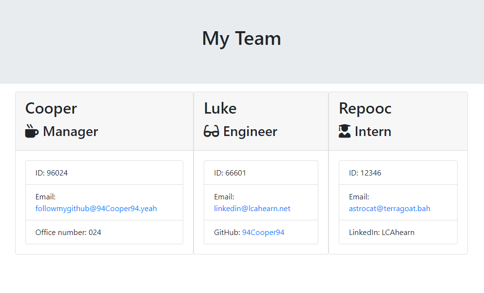
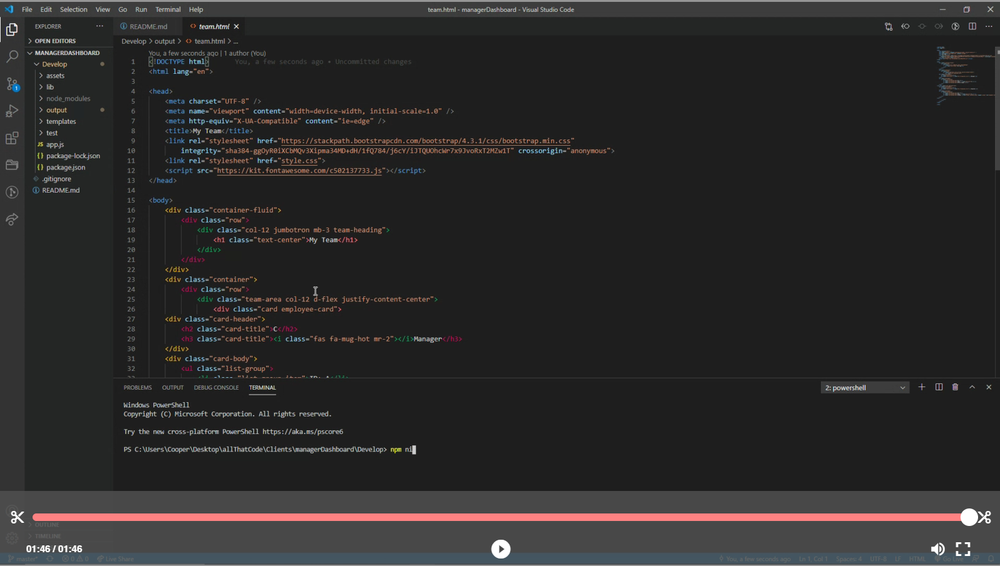

# managerDashboard

## Table of Contents
- [Description](#description)
- [Installation](#installation)
- [Tests](#tests)
- [License](#license)
- [Technology](#technology)
- [Contributors](#contributors)

## Description
  Interested in keeping all of your eggs in one basket? Utilize this simple and effective employee profile generator to conveniently manage and access colleague information all in one place. Gone are the days of wrestling with your address book hoping for a fleck of vital information only to have your dreams crushed. managerDashboard is here to help.

## Installation
Required packages: Simply run an 'npm install' in the parent directory prior to testing. I accessed npm's inquirer package in developing the question prompts & npm's jest package in order to pass the tests at each stage in development.
  
## Tests
To test, run the following command: First you'll need to run an 'npm install' in the parent directory. Second, you'll want to open your command terminal to the directory containing app.js and type 'node app.js'. Upon completing the final question and selecting the 'home' input option your 'team.html' file will appear in the output/ folder. *bonus: navigate to the test/ folder in your command terminal and run an 'npm test' to see the glossy finish!

## License
MIT

## Technology
JavaScript, node.js, npm inquirer, npm jest, GitHub

## Contributors
Cooper Ahearn

## Contact

 

For a step by step video:

If you have any questions, contact the author directly at LCAhearn94@gmail.com.